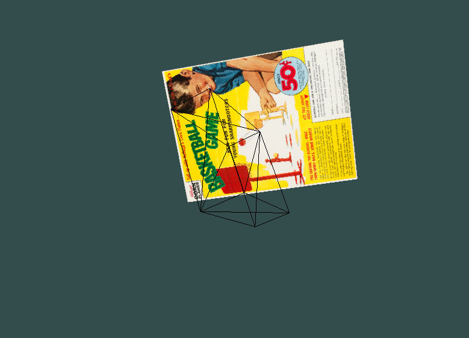

# Pose Estimation
### By Sequoyah Walters (NetID: snwalters2), Sriram Ashokkumar (NetID: ashokkumar2), and Jingxin Du (NetID:jdu86)

# Resources
### [Project Presentation Slides](https://docs.google.com/presentation/d/1wN2tkIdrWc6zNNb7Fr0up25WB-uktFyzhzcq5vQqLLs/edit?usp=sharing)
### [Project Presentation Video](https://uwprod-my.sharepoint.com/:v:/g/personal/snwalters2_wisc_edu1/EUkXcHxw2dlCgaERJGYHZI4BxNixHhj5xG-2ZKZ3xNmBFQ?e=WHZoqO)
### [Project Proposal](https://drive.google.com/file/d/1hC8oRceYPUFodSvo5DaotZEf3OexQ76n/view?usp=share_link)
### [Project Mid-term Report](https://drive.google.com/file/d/178fejKkhdA7yCzVx__yCsbTKTNsXARnO/view?usp=share_link)
### [Project Source Codes](https://github.com/seqwalt/PoseEstimation)

# Problem
Many applications require the knowledge of the position and orientation (pose) of an object sometimes even predicting the pose of a moving object. This problem is not necessarily novel and numerous solutions exist.However, modern approaches to this issue use computationally intensive neural network (NN) methods, restricting usage of applications with low size, weight and power (SWaP). We estimated the object pose with similar performance to NN methods on a simple problem domain for usage by low-SWaP systems. Simplifying assumptions include knowledge of the object 3D model, a non-cluttered scene and only considering the pose of a single object.

# Motivation
We are interested in this problem as we want to predict the pose of an object using low SWaP systems. Current solutions to this problem require extensive computation and would not be feasible in a low SWaP system. There are several applications in which this approach would be beneficial, including quick obstacle avoidance and fast object trajectory estimation. 

Low SWaP systems include quadcopters where there is a restriction on computing power due to their small size. An example where our solution could be used would be a quadcopter trying to fly through a narrow gap in an object as shown in the figure below. In this situation, there is a limitation on computational power as the quadcopter has to be light and the algorithm also needs to be fast due to high-speed flight.

    <em>Figure: Quadcopter flying through narrow gap in paper [3]</em>

# Approach
<!-- This work aims to re-implement and improve a classical pose estimation approach for a unique setting. By considering the application of low-SWaP systems, our algorithm must be extremely light-weight and efficient in order to obtain good performance. Existing approaches do not consider the use of low-SWaP systems, so we aim to design an algorithm that can perform better for these types of systems. -->
We predicted the pose of a single object with a known 3D model. ORB features
will be detected in the image, and compared to a reference image for feature matching. Using EPnP, the popular 2D/3D perspective-n-point method proposed in [2], we can quickly generate pose estimations from point correspondences.

## 3D Object Model - OpenGL
OpenGL was used with C++ to create a very simple rendering engine. It currently
can display in 3D a box object, as shown in the figure and video below. While this OpenGl renderer is very simple, it allows us full control to display the wire-mesh of the model, which is useful when estimating pose with our algorithm. 

<!-- Additionally, as long as we can render a model that has visually rich regions (such as the cereal box), our algorithm should be able to detect features properly. -->

    <em>Figure: Cereal box model in our 3D renderer (demo) </em>

<video width="480" controls>
    <source src="./assets/testvid1.mp4" type="video/mp4">
</video>

    <em>Video: Cereal box model in our 3D renderer (demo) </em>

## ORB Feature Extraction and Matching
For featuer extraction, we decided to go with ORB(Oriented FAST and Rotated BRIEF) features. ORB features are extracted from each reference image and stored. These 2D features have known 3D counterparts. This process is done in under 9 milliseconds.

    <em>Figure: Feature extraction in our 3D renderer (demo) </em>

<video width="640" controls>
    <source src="./assets/cereal.mp4" type="video/mp4">
</video>

    <em>Video: Feature extraction in our 3D renderer (demo) </em>

Next, ORB feature detection is computed over the new image, and feature matching is done between this new image and a reference image. We decided to go with a brute force matching approach using the minimum Hamming distance as it was able to match the orb features in under 0.5 milliseconds. Since the features in the reference image have known 3D values, this information is used for pose estimation described in the next section.

    <em>Figure: Our feature detection and matching algorithm demo in real</em>

    <em>Figure: Our feature detection and matching algorithm demo in our 3D renderer</em>

## Pose Estimation
For pose estimation, we used Efficient Perspective-n-Point(EPnP) as shown in the figure below. The EPnP approach takes in the features in the image that coordinate to the 3D points as a weighted sum of four virtual control points. This is less computationally heavy as it allows us to reduces the problem to estimating the position of these control points in the camera reference frame. The solution is an accurate non-iterative O(n) solution to the PnP problem. The main motivation for EPnP was the computation time of around 3 milliseconds. EPnP is much faster than other PnP methods even for large n values.

    <em>Figure: EPnP - Reprojection of the model of the box on three video frames demo in paper [2]</em>

    <em>Figure: Our pose estimation result demo</em>

# Evaluation
## Metrics

We evaluated the performace of our pose estimation algorithm using 4 critereas.
1. Average Distance of Model Points (ADD)[1]: 

    Calculates the average pairwise distance between the 3D model transformed according to the ground truth pose and the estimated pose.

    

    where $\mathcal{M}$ denotes the set of 3D model points, $m$ denotes the number of points, $\mathbf{R}$ denotes the ground truth rotation, $\mathbf{T}$ denotes the ground truth translation, $\tilde{\mathbf{R}}$ denotes the estimated rotation, and $\tilde{\mathbf{T}}$ denotes the estimated translation.

2. Average Closest Point Distance (ADD-S)[1]:

    Calculates the average distance from each 3D model point transformed according to the estimated pose to its closest neighbour on the target model according to the ground truth pose.

    

    Given ADD or ADD-S, we can calculate the area under the accuracy-threshold curve (AUC). One approach is better than another if it yields higher AUC.

3. Relative Error [2]: 
    
    Calculates the relative error of the estimated rotation and translation.

    

4. Computational Speed [2]:

    To evaluate the computational speed of an approach, we run the codes of that approach 10 times on our testing dataset using Macbook Air, and then record their average run time. One approach is better than another if it takes shorter time.

# Results
In evaluating our method, we found that the estimated pose of the object had large amounts of noise, making it unreliable to use as a useful pose estimator. In order to try to fix this bug, many things we tried. First, as can be seen in the matching image, we made sure the feature matching was working properly. We then ensured the 3D-2D correspondences of the reference image we accurate. This was done using two different methods, both verifying the accuracy of the correspondences. Next, instead of simply implementing EPnP, we implemented EPnP with Ransac. However, even after these checks and improvements, the result was too error-prone.

# Reflection / Future Plans
Overall this project was a really great learning experience for both OpenCV and OpenGL simulation. Future work includes implementing a Kalman filter to try to filter the data in order to obtain a reasonable result. After that, we plan to further implement this for applications such as a quadcomputer trying to fly through a narrow gap in an object.

# References

[1] Y. Xiang, T. Schmidt, V. Narayanan, and D. Fox, “Posecnn: A convolutional neural network for 6d object pose estimation in cluttered scenes,” arXiv preprint arXiv:1711.00199, 2017.

[2] V. Lepetit, F. Moreno-Noguer, and P. Fua, “EPnP: An accurate o(n) solution to the PnP problem,”vol. 81, no. 2, pp. 155–166

[3] D. Falanga, E. Mueggler, M. Faessler, and D. Scaramuzza, “Aggressive quadrotor flight through narrow gaps with onboard sensing and computing using active vision,” in 2017 IEEE International Conference on Robotics and Automation (ICRA), pp. 5774–5781.

[4] “https://github.com/raulmur/orb_slam2”
